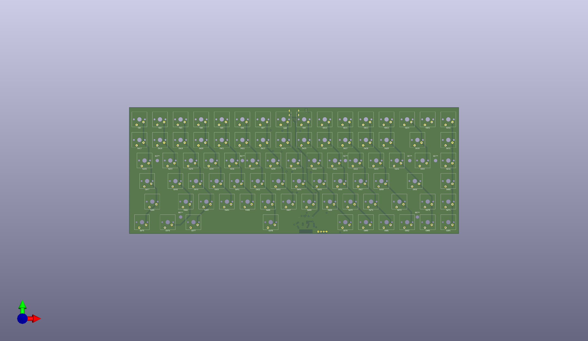
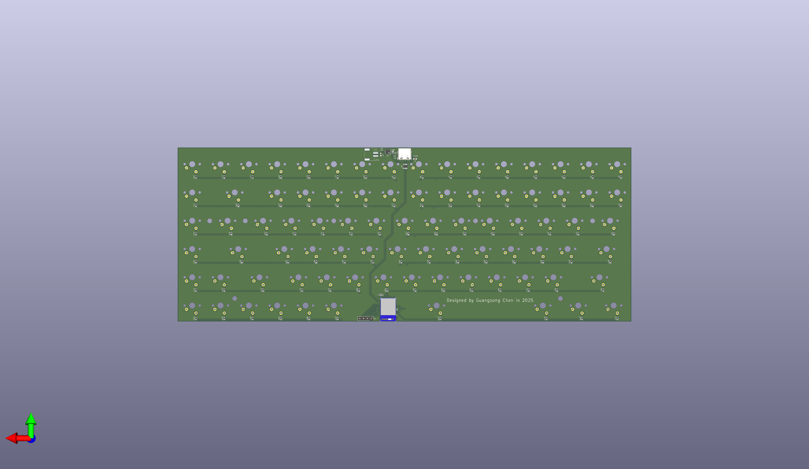

# Custom Keyboard PCB

This repository contains the KiCad design files for a custom mechanical keyboard PCB.

## Preview

### Front

### Back

## Project Structure

- **KiCad Files:**
  - `keyboard.kicad_pro`: Project file.
  - `keyboard.kicad_sch`: Schematic file.
  - `keyboard.kicad_pcb`: PCB layout file.

- **Manufacturing Files:**
  - `keyboard_bom.csv`: Bill of Materials.
  - `keyboard-top.pos` / `keyboard-bottom.pos`: Pick and place position files.
  - `pcb.pdf`: Printable PCB view.

## Tools Used

- **KiCad**: Electronics Design Automation Suite.
- **kbplacer**: Component placement tool (suggested by `kbplacer.log`).
